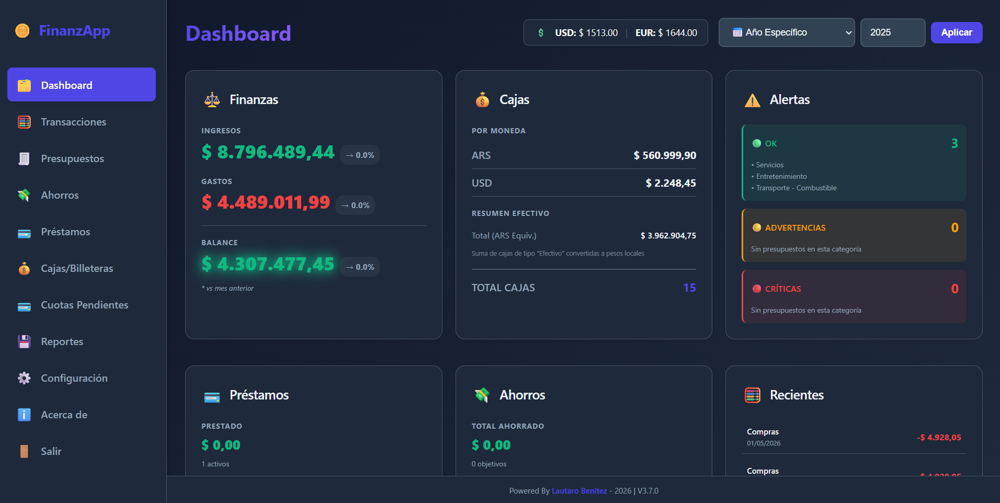

# 💰 FinanzApp - Gestión de Finanzas Personales (V3.8.1)

[](https://lautaro-benitez.github.io/APP_Finanzas/)
[](CHANGELOG.md)
[](LICENSE)


<!-- BADGES_START -->
[](https://www.electronjs.org/)
[](https://developer.mozilla.org/en-US/docs/Web/JavaScript)
[](https://developer.mozilla.org/en-US/docs/Web/HTML)
[](https://developer.mozilla.org/en-US/docs/Web/CSS)
[](https://nodejs.org/)

**FinanzApp** es una potente aplicación de escritorio diseñada para el control total de tus finanzas personales de manera local, privada y segura. 



---

## 🚀 Características Principales

- **Gestión Multi-Caja:** Control de múltiples billeteras y cajas (ARS/USD).
- **Control de Transacciones:** Registro detallado de ingresos y egresos.
- **Módulo de Préstamos:** Seguimiento exhaustivo de préstamos otorgados y recibidos, con sistemas de amortización integrados.
- **Cuotas Pendientes:** Gestión inteligente de compras en cuotas con vencimientos automáticos.
- **Reportes Avanzados:** Gráficos interactivos y análisis de tendencias.
- **Privacidad Total:** Tus datos nunca salen de tu computadora (IndexedDB local).
- **Exportación/Importación:** Copias de seguridad en formato JSON para portabilidad de datos.

---

## 🛠️ Requisitos e Instalación

### Requisitos
- **Sistema Operativo:** Windows 10/11 (macOS/Linux compatible via build).
- **Espacio en disco:** ~200 MB.

### Instalación (Usuario Final)
Esta aplicación es **portable**, no requiere una instalación tradicional:
1. Descarga el paquete `FinanzApp-win32-x64.zip`.
2. Extrae el contenido en una carpeta segura (ej: `Documentos/FinanzApp`).
3. Ejecuta `finanzapp.exe` para comenzar.

> [!TIP]
> Puedes crear un acceso directo en el escritorio haciendo clic derecho sobre el ejecutable y seleccionando "Enviar a > Escritorio".

### Desarrollo
Para ejecutar el entorno de desarrollo:
```bash
# Instalar dependencias
npm install

# Iniciar en modo desarrollo
npm start

# Generar ejecutable (Windows)
npm run pack:win
```

---

## 🔐 Seguridad y Primer Uso

**⚠️ Importante:** Durante el primer uso de la aplicación, es necesario **crear un usuario y una contraseña**. 

Toda la información y los datos que ingreses **se guardan localmente en tu propio dispositivo** (en el almacenamiento del navegador) y **NO en la nube**. Por lo tanto, para evitar la pérdida de información en caso de que ocurra algún problema con tu computadora, es **estrictamente necesario que realices backups (copias de seguridad) cada ciertos días** utilizando la opción de "Exportar" dentro de la configuración de la app.

---

## 📄 Licencia y Créditos

- **Desarrollado por:** [Lautaro Benitez](https://github.com/Lautaro-Benitez)
- **Tecnologías:** Electron, D3.js, Chart.js, Vanilla CSS & JS.

---
© 2026 Lautaro Benitez - Software de Gestión Personal.
